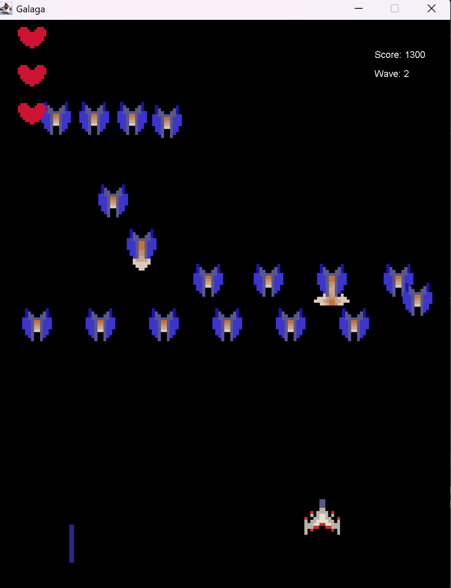

# HS-Galaga

A Java-based arcade shooter inspired by the classic Galaga game. Players control a spaceship at the bottom of the screen, shoot incoming alien waves, and aim for high scores.  
This project demonstrates **object-oriented programming, game loop logic, collision detection, and graphics handling in Java**.

## Features

- Player-controlled spaceship: moves left/right and slightly up/down; limited shooting speed.  
- Multiple alien types with distinct behaviors, implemented as subclasses of a base `Alien` class.  
- Scoring & lives: players earn points for destroying aliens and lose a life when hit by lasers (3 lives).  
- Real-time updates: the game runs at ~60 FPS, updating all entities efficiently using arrays.  
- Collision detection: implemented by comparing `x` and `y` coordinates of objects.  
- Custom assets: 47 16x16 images for lasers, aliens, player, explosions, and buttons stored in a `res` folder.  

## Technologies & APIs

- **Java Swing:** GUI rendering  
- **Java AWT:** Colors, lists, and graphics handling  
- **Custom Event Handling:** Detects key presses for movement and shooting  
- **Image Processing:** Preloaded images for smooth rendering  
- **Object-Oriented Design:** Classes for entities (Player, Alien, Laser, Hearts) and game logic  

## Gameplay Screenshots

### 1. Starting Screen
  
Initial screen before the game begins, giving players a clear starting point.

### 2. Wave 1 – Aliens Entering
  
First wave of enemies entering the screen, demonstrating spawn mechanics and initial gameplay.

### 3. Wave 2 – Mid-Game Action
  
Favorite wave! Player shooting at multiple alien types while avoiding enemy lasers, highlighting collision detection and dynamic gameplay.

### 4. Game Over / Restart Screen
  
Displays the player's score and allows restarting the game, showing game logic for death and replay.

## Classes & Architecture

- **Galaga:** Main class; initializes the game and display.  
- **Display:** Extends `JPanel`; handles game loop, object updates, and rendering.  
- **KeyController:** Tracks user input (WASD + spacebar) for player actions.  
- **Entity:** Base class for all objects in the game (Player, Alien, Laser, Hearts).  
- **Player:** Controls movement, health, shooting, and interacts with collisions.  
- **Alien:** Enemy class; manages movement, health, shooting, and wave patterns.  
- **Laser:** Moves up/down depending on shooter; checks collisions.  
- **Hearts:** Displays player lives.  
- **Wave:** Generates enemy waves based on score, time, or enemies defeated.  

## Skills Demonstrated

- Object-oriented programming & class inheritance (subclassing for alien types)  
- Event-driven programming and input handling  
- Real-time game loop design (60 FPS)  
- Collision detection and entity management  
- GUI design with Java Swing and AWT  
- Resource management and image processing for smooth gameplay  

## Status

Fully playable self-study project showcasing Java game development and OOP principles.
